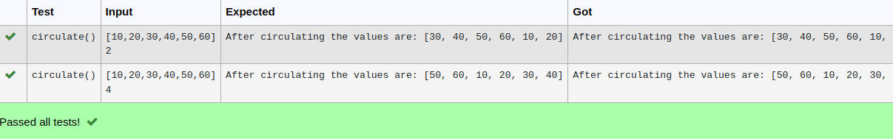

# Circulate-the-values-of-N-variables
## Aim:
To write a python program to circulate the n variables using function concept
## Equipment’s required:
PC
Anaconda - Python 3.7
## Algorithm: 
### Step 1: 
first step is to define from the user
### Step 2: 
get a,n input from the user
### Step 3: 
Get the value from the user for the number of rotation
### Step 4: 
Using the slicing concept rotate the list

### Step 5: 
define formula step
### Step 6: 
print the result
## Program:
```python
#Program to circulate N values.
#Developed by: prithviraj
#RegisterNumber:22004659
def circulate():
  g=eval(input())
  n=int(input())
  rot=g[n:]+g[:n]
  print('After circulating the values are:', rot)
  ```
## Output:


## Result:
by this program we can circulate the values of this program